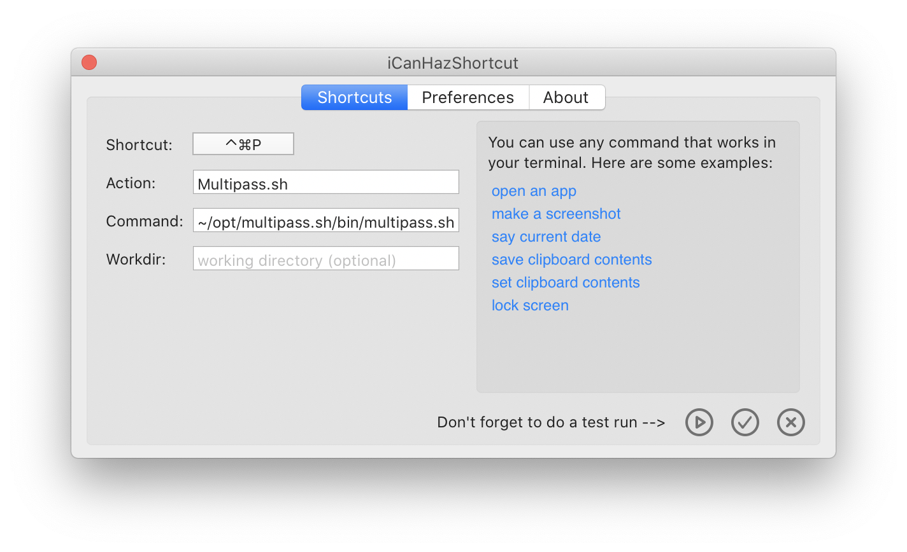

multipass.sh
============

**multipass.sh** est un outil de création et de gestion de mots de passe modulaire écrit en [Bash] ayant pour objectif
de conserver uniquement la façon de les générer à partir d'un mot de passe maître.

Il applique une [fonction de hachage cryptographique] sur une concaténation du nom du site lié au mot de passe à
générer et le mot de passe maître.  Cette opération est effectuée un nombre défini d'itérations ce qui rend
virtuellement impossible de récupérer le mot de passe maître à partir du mot de passe généré.

## Utilisation

### Sous Ubuntu

    # Dépendances
    sudo apt install git openssl xdotool zenity python3-lz4

    # Télécharger
    mkdir -p ~/opt; cd ~/opt
    git clone https://github.com/JoProvost/multipass.sh.git

    # Configurer l'environnement
    mkdir -p ~/.multipass.sh

    # Exécuter ou associer à un hot-key
    ~/opt/multipass.sh/bin/multipass.sh [site]

### Sous OSX

    # Dépendances (voir https://brew.sh/)
    /usr/bin/ruby -e "$(curl -fsSL https://raw.githubusercontent.com/Homebrew/install/master/install)"
    brew install coreutils
    brew install gnu-sed
    brew install zenity

    # Télécharger
    mkdir -p ~/opt; cd ~/opt
    git clone https://github.com/JoProvost/multipass.sh.git

    # Configurer l'environnement
    mkdir -p ~/.multipass.sh
    cat > ~/.multipass.sh/.env <<"EOF"
    export PATH="$(brew --prefix coreutils)/libexec/gnubin:$PATH"
    export PATH="$(brew --prefix gnu-sed)/libexec/gnubin:$PATH"
    export LANG="fr_CA.UTF-8"
    EOF

    # Exécuter ou associer à un hot-key
    ~/opt/multipass.sh/bin/multipass.sh [site]
    
#### Raccourci clavier

Il est recommandé d'associer ce script à une action rapide clavier (hot-key) grâce à [iCanHasShortcuts].

## Adaptateurs
Les fonctionnalités de l'application sont supportées par un ensemble d'adapteurs afin de s'adapter à l'environnement et
aux outils disponibles.

### X11
À l'exécution dans un environnement graphique X11, [Zenity] sera utilisé pour l'interaction avec l'utilisateur alors
que [xdotool] sera responsable de taper le mot de passe pour l'utilisateur.

### OSX
Sur OSX, les variantes GNU de `sed` et de `readlink` doivent avoir été installées préalablement et présentes dans
`$PATH`. `osascript` sera utilisé pour l'interaction avec l'utilisateur et sera responsable de taper le mot de
passe pour l'utilisateur.

### Android
Sous Android, [Termux-dialog] assure l'interaction avec l'utilisateur.  Pour éviter de passer par le presse-papier
partagé, le mot de passe est tappé dans l'interface graphique à l'aide de l'outil de test [input], exécutable
uniquement par [ADB], ce qui impose l'exécution d'un service via [ADB] à chaque redémarrage du téléphone.

### Windows
L'application peut fonctionner sous Windows grâce à [Cygwin/X] en activant `openssl`, `zenity`, `xorg-server` et
`xinit`.  `xlaunch` et `git` peuvent également s'avérer utiles.  L'application [xdotool-for-windows] doit être
présente dans le `$PATH` de l'application pour taper le mot de passe pour à la place de l'utilisateur.

## À voir aussi
 - [Cryptnos] d'où provient l'inspiration pour ce projet.

[Cryptnos]: https://www.cryptnos.com/
[Bash]: https://fr.wikipedia.org/wiki/Bourne-Again_shell
[fonction de hachage cryptographique]: https://fr.wikipedia.org/wiki/Fonction_de_hachage_cryptographique
[xdotool]: https://www.semicomplete.com/projects/xdotool/
[Zenity]: https://en.wikipedia.org/wiki/Zenity
[Termux-dialog]: https://wiki.termux.com/wiki/Termux-dialog
[input]: https://github.com/aosp-mirror/platform_frameworks_base/blob/master/cmds/input/src/com/android/commands/input/Input.java
[ADB]: https://developer.android.com/studio/command-line/adb
[xdotool-for-windows]: https://github.com/ebranlard/xdotool-for-windows
[Cygwin/X]: https://x.cygwin.com/
[iCanHasShortcuts]: https://github.com/deseven/icanhazshortcut
